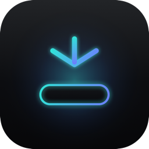

<div align="center">



# NotchDock

**Turn the MacBook notch into a file drag-and-drop command center.**

Drag any file toward the notch — NotchDock blooms open into a tactile hub of instant
conversion and cleanup actions. Drop, and it's done.


</div>

---

## Why

The space around the notch is dead pixels. NotchDock turns it into the fastest place on your
Mac to *do something with a file* — convert, compress, optimize, stash, or trash — without
opening an app, a Finder window, or a single dialog. It lives entirely in the menu bar (no Dock
icon), stays invisible until you need it, and animates in with a Dynamic-Island-style spring.

## Highlights

- 🎯 **Notch-anchored overlay** — a borderless panel that springs open below the notch with a
  precise state machine: `hidden → armed → peek → expand → processing`.
- 🪄 **Drag to reveal** — start dragging files anywhere and the hub expands automatically,
  surfacing the actions that fit what you're holding.
- ⚡ **15 instant actions** across three groups:
  - **Convert** — Image → PDF, PDF → Images, Office → PDF, Text → PDF, and image format
    conversions (JPEG / PNG / HEIC / WebP).
  - **Compress / Optimize** — ZIP, Unzip, optimize images, optimize PDF (keep text), resize images.
  - **Organize** — send to Workbench, move to Trash.
- ↩️ **8-second undo** for every destructive action — originals go to the Trash and snap right
  back, via the toast button or the **⌥⌘Z** global shortcut.
- 🧭 **Predictable output** — results land in `~/Downloads/NotchDock/YYYY-MM-DD/` with a clean
  `name__action__v1.ext` naming scheme and automatic collision handling.
- 🛡️ **Safe by default** — a one-time notice the first time an action moves originals to the Trash.
- ♿ **Accessible** — VoiceOver labels on every action and full **Reduce Motion** support.
- 🪶 **Featherweight** — adaptive pointer sampling (idle 180 ms → drag 30 ms) and an idle-CPU
  budget under ~1.5%.

<div align="center">

```
        ▁▁▁▁▁  ← notch
   ╭───────────────╮
   │  ↓  drop files │   armed → peek → expand
   ╰───────────────╯
   ┌───────┬───────┐
   │ → PDF │ Resize│   the Work Hub: chips light up
   ├───────┼───────┤   for the files you're dragging
   │ Zip   │ Trash │
   └───────┴───────┘
```

</div>

## How it works

NotchDock is a small, testable core wrapped in SwiftUI + AppKit:

| Layer | Role |
| --- | --- |
| `Core/OverlayStateMachine` | Pure reducer `(state, event, isDragging) → state` — fully unit-tested |
| `Core/TriggerEngine` | Debounced hysteresis (enter 35 ms / exit 100 ms) to kill trigger flapping |
| `Core/DragPipeline` · `HitMaskEngine` · `DropRoutingEngine` | Velocity sampling, capsule hit-testing, action routing |
| `Controllers/OverlayWindowController` | Borderless `NSPanel` at status-bar level, adaptive sampling, mouse pass-through |
| `ViewModel/NotchDockViewModel` | Single `@MainActor` source of truth feeding the SwiftUI views |
| `Services/WorkActionService` | The conversion engine (PDFKit · ImageIO · ZIPFoundation) + undo tokens |

The panel ignores the mouse everywhere except inside the capsule's hit-mask, so it never steals
clicks from the apps behind it.

## Build & Run

Requires **Xcode 15+** (macOS 14 SDK) and [XcodeGen](https://github.com/yonaskolb/XcodeGen)
(`brew install xcodegen`). The `.xcodeproj` is generated, not committed.

```bash
git clone https://github.com/River-181/mac-menubar.git
cd mac-menubar

xcodegen generate
xcodebuild -resolvePackageDependencies -project NotchDock.xcodeproj -scheme NotchDock
xcodebuild -project NotchDock.xcodeproj -scheme NotchDock \
  -configuration Debug -destination 'platform=macOS' build

# run the tests
xcodebuild -project NotchDock.xcodeproj -scheme NotchDock -destination 'platform=macOS' test
```

On first launch, grant **Accessibility** permission (System Settings → Privacy & Security →
Accessibility) to enable the global ⌥Space / ⌥⌘Z shortcuts.

## Shipping (Developer ID + notarization)

NotchDock distributes outside the Mac App Store so it can keep its cross-app drag detection.
Set `DEVELOPMENT_TEAM` in [`project.yml`](project.yml), then archive, sign with Hardened
Runtime (entitlements in [`NotchDock/NotchDock.entitlements`](NotchDock/NotchDock.entitlements)),
and notarize:

```bash
xcrun notarytool submit NotchDock.zip --keychain-profile "AC_PASSWORD" --wait
xcrun stapler staple NotchDock.app
```

A privacy manifest ([`PrivacyInfo.xcprivacy`](NotchDock/PrivacyInfo.xcprivacy)) is included.

## Keyboard shortcuts

| Shortcut | Action |
| --- | --- |
| `⌥Space` | Toggle the hub |
| `⌥⌘Z` | Undo the last destructive action |
| `Esc` | Collapse one level |

All shortcuts are rebindable in **Settings**.

## Tech stack

SwiftUI · AppKit · PDFKit · ImageIO · [ZIPFoundation](https://github.com/weichsel/ZIPFoundation) ·
[KeyboardShortcuts](https://github.com/sindresorhus/KeyboardShortcuts) ·
[LaunchAtLogin](https://github.com/sindresorhus/LaunchAtLogin-Modern) ·
[Sentry](https://github.com/getsentry/sentry-cocoa) (opt-in via `SENTRY_DSN`).

## Roadmap

This is the **v1 daily-driver** scope: a rock-solid notch drag-and-drop Work Hub. Planned next:
icon-strip launcher, the Workspace canvas (card piles + magnet clustering), search, and theme
presets. See [`spec.md`](spec.md) for the full product vision.

## License

[MIT](LICENSE) © 2026 River
